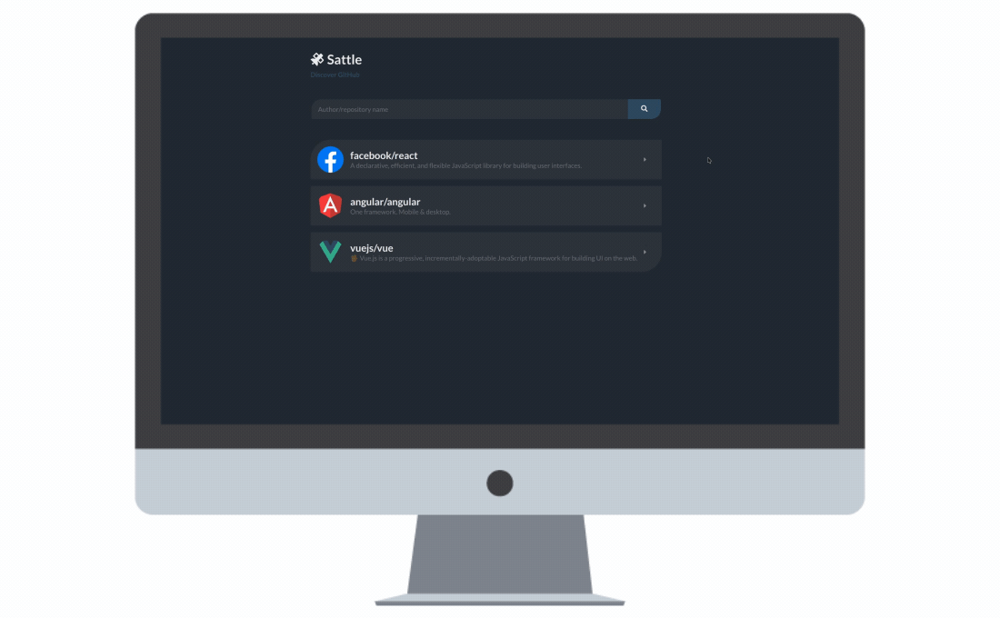

<h1 align="center">
  
</h1>
<h4 align="center">👽 Select repos to always have  by your side</h4>

### 💻 Preview

### 🔩 Functionalities

- User can add any github repository to the Dashboard
- Dashboard repositories are stored in the Local Storage
- Each repository has its details page which lits all issues
- User can click in any issue and be redirected to the GitHub page of that issue

### ⌛️ Implementations

- [ ] Responsiveness
- [ ] Favicon
- [ ] Pagination
- [ ] Delete repository 

### 🖱 Technologies

- [ReactJS](https://reactjs.org/)
- [TypeScript](https://www.typescriptlang.org/)
- [Axios](https://github.com/axios/axios)
- [Styled Components](https://styled-components.com/)

### 📡 APIs

- [GitHub API](https://developer.github.com/v3/)

## 📬 [Contact me](https://www.linkedin.com/in/guerrero-roberto/)
